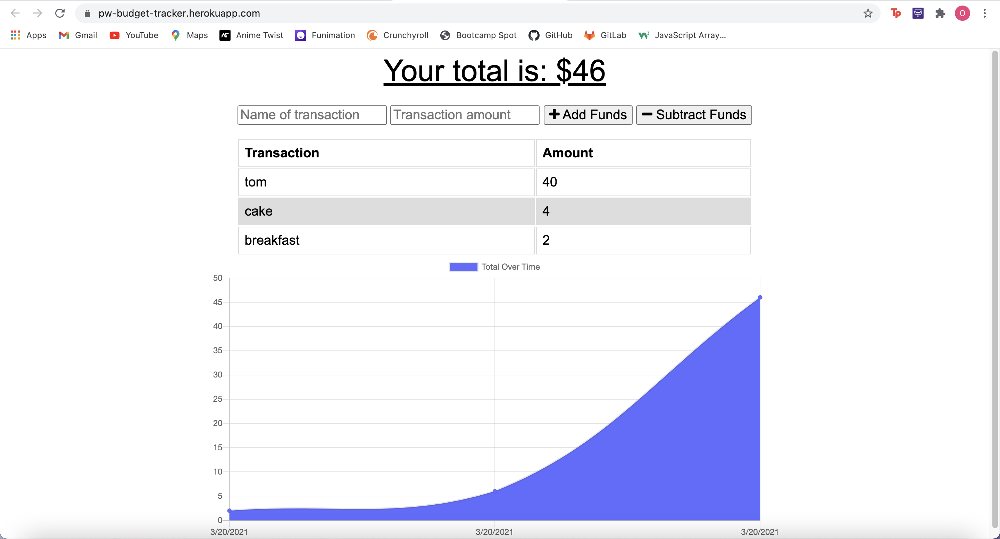

# week-18-pwa-budget-tracker

### What it does:

* Workout Tracker is a budget tracker that lets users view, add and subtract funds. 

* Users are able to add expenses and deposists to their budget with or without a connection.

* Transactions entered offline will populate once the application is brought back online.

## Technology Used

* indexedDB

* Express

* MongoDB / Atlas

* Mongoose

* Node.js 

* package.JSON

* gitignore

* Javascript

## Links

* [GitHub repository](https://github.com/omaymaahmad/week-18-pwa-budget-tracker) 

* [Heroku Deployed Link](https://pw-budget-tracker.herokuapp.com/) 

* [My GitHub](https://github.com/omaymaahmad)  

* My Email: <omayma.ahmad25@gmail.com>

## Screenshot of Application

